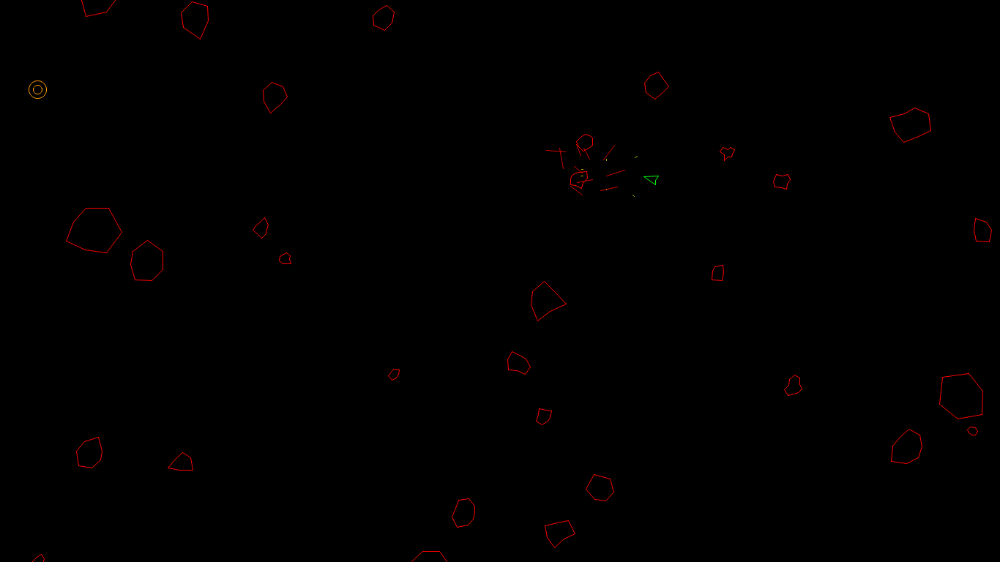
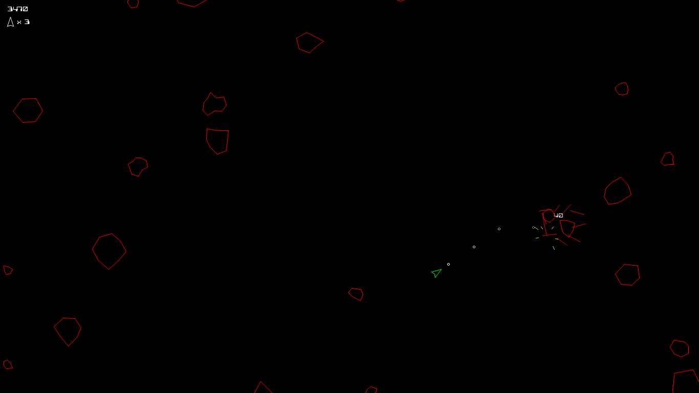

# asteroids

This is a clone of Asteroids that I made in early 2013 as part of a University course.

To toot my own horn for a moment, it earned me top of the class, and in the following year, top prize in a game development competition - which included a trophy and a sweet $700 AUD.

No guarantees that it still compiles just yet - I'll eventually get around to establishing a release process for the game.\
<small><small>Honestly, not even sure it works on Windows 10...</small></small>

Enjoy!\
\- SpiltCoffee

## Requirements

### Windows

- FreePascal >=2.4.0 (https://www.freepascal.org/download.html)
  - Make sure to install the Free Pascal Utilities or else `fpcres.exe` may be missing
- cygwin/mingw32 (git-for-windows can suffice: https://gitforwindows.org/)

## Building

- Clone the repository, then:
  - Run `./build.sh` (program will be output into `./out/`), OR
  - Run `./run.sh` (runs `./build.sh` first, then executes)

## Screenshots

